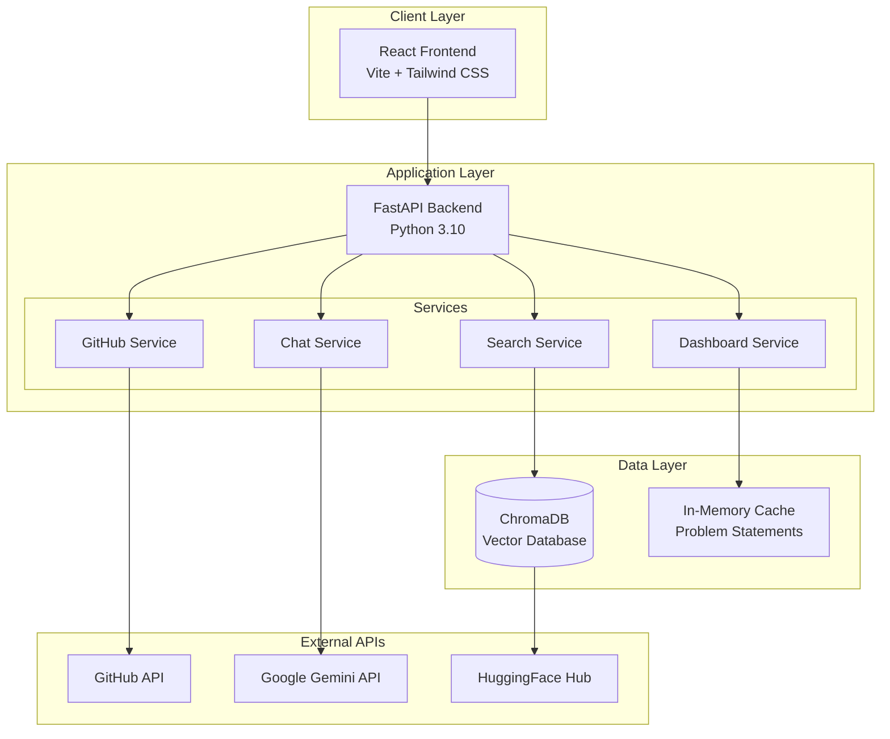
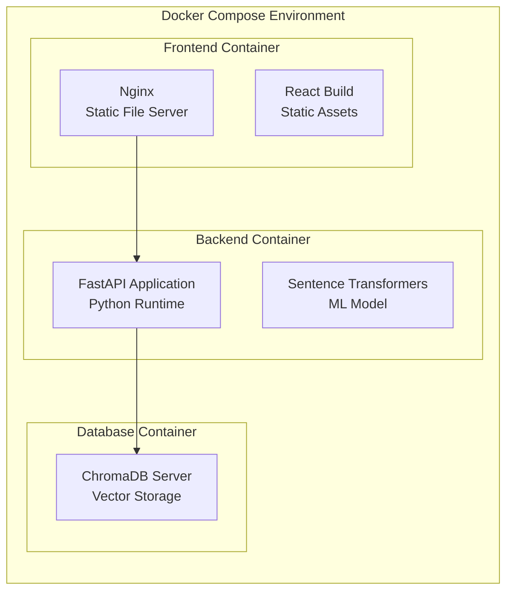

# Design Document

## Overview

The SIH Solver's Compass is architected as a modern, containerized web application following a microservices pattern with a React frontend, FastAPI backend, and ChromaDB vector database. The system leverages AI/ML technologies including sentence transformers for semantic search, GitHub API integration for personalized recommendations, and Google Gemini for interactive problem exploration.

The application follows a clean architecture pattern with clear separation between presentation, business logic, and data layers, ensuring maintainability and scalability.

## Architecture

### High-Level Architecture



### Container Architecture



## Components and Interfaces

### Frontend Components

#### Core Layout Components
- **AppLayout**: Main application wrapper with navigation and routing
- **Header**: Navigation bar with search input and GitHub integration button
- **Sidebar**: Navigation menu for different sections (Search, Dashboard, etc.)

#### Page Components
- **HomePage**: Landing page with prominent search interface
- **SearchResultsPage**: Displays search results in a card-based layout
- **ProblemDetailPage**: Two-pane layout showing problem details and chat interface
- **DashboardPage**: Analytics dashboard with multiple chart components

#### Feature Components
- **SearchBar**: Intelligent search input with autocomplete suggestions
- **ProblemCard**: Reusable card component for displaying problem summaries
- **ChatInterface**: Real-time chat component with message history
- **GitHubModal**: Modal for GitHub username input and repository analysis
- **ChartComponents**: Reusable chart wrappers for different visualization types

#### UI Components
- **Button**: Styled button component with hover states
- **Modal**: Reusable modal wrapper with backdrop
- **LoadingSpinner**: Loading indicator for async operations
- **ErrorBoundary**: Error handling wrapper for component failures

### Backend API Endpoints

#### Search Service (`/api/search`)
```python
@router.post("/search")
async def semantic_search(query: SearchQuery) -> List[ProblemStatement]:
    """
    Performs semantic search using sentence transformers
    Input: Natural language query string
    Output: List of ranked problem statements with similarity scores
    """
```

#### GitHub Service (`/api/recommend-github`)
```python
@router.post("/recommend-github")
async def github_recommendations(username: str) -> List[ProblemStatement]:
    """
    Analyzes GitHub profile and recommends problems
    Input: GitHub username
    Output: Personalized problem recommendations
    """
```

#### Chat Service (`/api/chat`)
```python
@router.post("/chat")
async def chat_with_problem(chat_request: ChatRequest) -> StreamingResponse:
    """
    Interactive chat about specific problem statement
    Input: Problem context and user question
    Output: Streaming AI response
    """
```

#### Dashboard Service (`/api/stats`)
```python
@router.get("/stats")
async def get_dashboard_stats() -> DashboardStats:
    """
    Provides aggregated statistics for dashboard
    Output: Chart data for categories, keywords, organizations
    """
```

### Data Models

#### Core Domain Models
```python
class ProblemStatement(BaseModel):
    id: str
    title: str
    organization: str
    category: str
    description: str
    technology_stack: List[str]
    difficulty_level: str
    created_at: datetime
    
class SearchQuery(BaseModel):
    query: str
    limit: int = 20
    
class ChatRequest(BaseModel):
    problem_id: str
    problem_context: str
    user_question: str
    
class GitHubProfile(BaseModel):
    username: str
    repositories: List[Repository]
    tech_stack: List[str]
    
class DashboardStats(BaseModel):
    categories: Dict[str, int]
    top_keywords: List[Tuple[str, int]]
    top_organizations: Dict[str, int]
```

## Data Models

### Vector Database Schema

ChromaDB will store problem statements as vector embeddings with associated metadata:

```python
# Vector Collection Structure
collection_name = "problem_statements"
embeddings = [vector_embedding_512_dim]  # From sentence-transformers
metadatas = [{
    "id": "problem_001",
    "title": "AI-Based Traffic Management",
    "organization": "Ministry of Transport",
    "category": "Software",
    "description": "Full problem description...",
    "technology_stack": ["Python", "TensorFlow", "OpenCV"],
    "difficulty": "Medium"
}]
```

### In-Memory Cache Structure

For dashboard statistics and frequently accessed data:

```python
# Cached aggregations for dashboard
dashboard_cache = {
    "categories": {"Software": 150, "Hardware": 75, "Blockchain": 25},
    "keywords": [("AI", 45), ("IoT", 32), ("Blockchain", 28)],
    "organizations": {"DRDO": 15, "ISRO": 12, "Railways": 10}
}
```

## Error Handling

### Frontend Error Handling
- **Network Errors**: Retry mechanism with exponential backoff
- **API Errors**: User-friendly error messages with action suggestions
- **Component Errors**: Error boundaries to prevent app crashes
- **Validation Errors**: Real-time form validation with clear feedback

### Backend Error Handling
- **Input Validation**: Pydantic models for request validation
- **External API Failures**: Graceful degradation and fallback responses
- **Database Errors**: Connection pooling and retry logic
- **Rate Limiting**: GitHub API rate limit handling with caching

### Error Response Format
```python
class ErrorResponse(BaseModel):
    error: str
    message: str
    details: Optional[Dict] = None
    timestamp: datetime
```

## Testing Strategy

### Frontend Testing
- **Unit Tests**: Jest for component logic and utility functions
- **Integration Tests**: React Testing Library for component interactions
- **E2E Tests**: Cypress for complete user workflows
- **Visual Tests**: Storybook for component documentation and visual regression

### Backend Testing
- **Unit Tests**: pytest for service layer and utility functions
- **Integration Tests**: FastAPI TestClient for API endpoint testing
- **Database Tests**: In-memory ChromaDB for vector operations testing
- **Load Tests**: Locust for performance testing under load

### Test Coverage Requirements
- Minimum 80% code coverage for backend services
- All API endpoints must have integration tests
- Critical user paths must have E2E test coverage
- Performance benchmarks for search response times (<500ms)

### Testing Infrastructure
```python
# Test configuration
@pytest.fixture
def test_client():
    return TestClient(app)

@pytest.fixture
def mock_chroma_db():
    return MockChromaDB()

@pytest.fixture
def sample_problem_statements():
    return load_test_data("problems.json")
```

## Security Considerations

### API Security
- **Rate Limiting**: Implement rate limiting on all endpoints
- **Input Sanitization**: Validate and sanitize all user inputs
- **CORS Configuration**: Proper CORS setup for frontend-backend communication
- **API Key Management**: Secure handling of Gemini API keys via environment variables

### Data Security
- **Vector Data**: No sensitive personal information in embeddings
- **GitHub Data**: Only public repository information, no private data access
- **Chat Logs**: Optional chat history with user consent and data retention policies

### Container Security
- **Base Images**: Use official, minimal base images (python:3.10-slim, node:18-alpine)
- **Non-root Users**: Run containers with non-root users
- **Secret Management**: Environment variables for sensitive configuration
- **Network Isolation**: Container network isolation in Docker Compose

## Performance Optimization

### Frontend Performance
- **Code Splitting**: Lazy loading for route-based components
- **Asset Optimization**: Image compression and CDN delivery
- **Caching Strategy**: Browser caching for static assets
- **Bundle Size**: Tree shaking and dependency optimization

### Backend Performance
- **Vector Search**: Optimized ChromaDB queries with proper indexing
- **Caching**: Redis-like caching for frequently accessed data
- **Connection Pooling**: Database connection management
- **Async Processing**: FastAPI async/await for I/O operations

### Database Performance
- **Vector Indexing**: Proper ChromaDB collection configuration
- **Query Optimization**: Efficient similarity search parameters
- **Data Partitioning**: Logical separation of problem categories
- **Backup Strategy**: Regular vector database backups

## Deployment Configuration

### Docker Compose Services
```yaml
# Production-ready configuration
services:
  frontend:
    build: ./frontend
    ports: ["80:80"]
    environment:
      - NODE_ENV=production
    
  backend:
    build: ./backend
    ports: ["8000:8000"]
    environment:
      - GEMINI_API_KEY=${GEMINI_API_KEY}
      - CHROMA_HOST=chroma-db
    
  chroma-db:
    image: ghcr.io/chroma-core/chroma:0.4.22
    volumes: ["chroma-data:/chroma/.chroma/index"]
    ports: ["8001:8000"]
```

### Environment Configuration
- **Development**: Hot reloading, debug logging, test data
- **Production**: Optimized builds, error logging, real data
- **Staging**: Production-like environment for testing

This design provides a solid foundation for building a scalable, maintainable, and user-friendly AI-powered guidance platform that meets all the specified requirements.